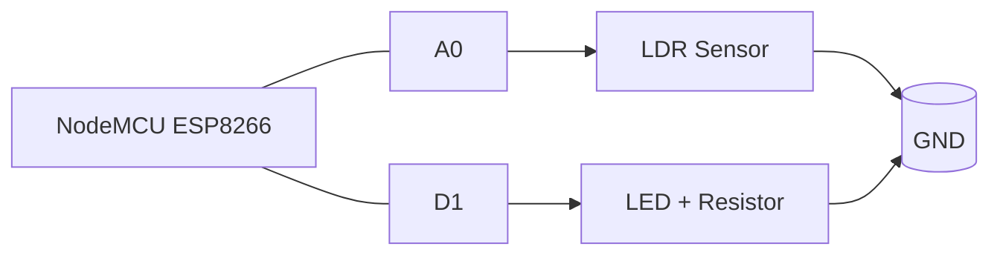
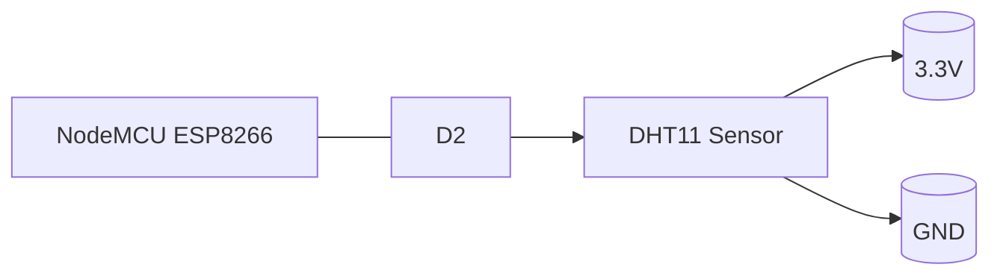
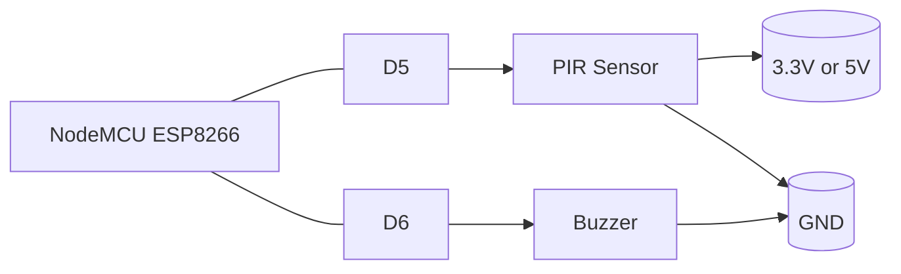
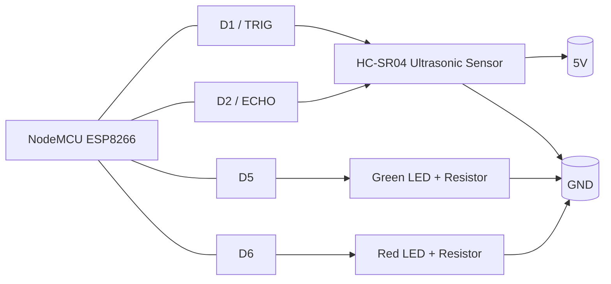
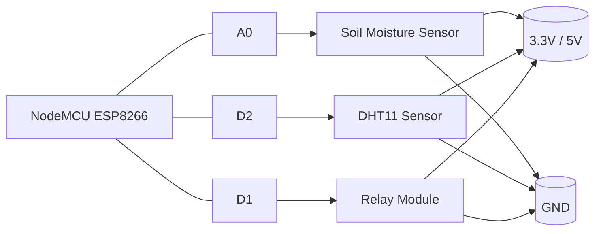

# IoT Workshop Code Repository

This repository contains the Arduino sketches used in the IoT workshop. Each folder is a separate project that demonstrates ESP8266 use cases such as sensor monitoring, motion detection, parking assistance, and relay control.

The code is written for a NodeMCU ESP8266 board and is intentionally beginner-friendly: each sketch includes serial output and clear pin definitions. Project 1 focuses only on local hardware behavior, while later projects include ThingsBoard telemetry.

## What’s in This Repo

| Project | Purpose | Main Hardware |
| --- | --- | --- |
| Project 1 | LDR-based light detection with local LED control | LDR, LED |
| Project 2 | Temperature and humidity monitoring | DHT11 |
| Project 3 | Motion detection alarm | PIR sensor, buzzer |
| Project 4 | Smart parking assistant | HC-SR04 ultrasonic sensor, 2 LEDs |
| Project 5 | Smart irrigation with local automation and RPC override | Soil moisture sensor, DHT11, relay module |

## Recommended Board

- NodeMCU ESP8266
- USB cable for programming and power
- Breadboard and jumper wires

## Before You Start

Install these tools and libraries in Arduino IDE:

- ESP8266 board support package
- PubSubClient
- DHT sensor library
- Adafruit Unified Sensor
- ArduinoJson

You will also need:

- A Wi-Fi network name and password (Projects 2-5)
- A ThingsBoard Cloud account (Projects 2-5)
- A ThingsBoard device access token for each cloud-enabled sketch (Projects 2-5)

## Common Workshop Setup

1. Open the project folder you want to upload in Arduino IDE.
2. Install the required libraries listed above.
3. Select the correct board, usually `NodeMCU 1.0 (ESP-12E Module)`.
4. Select the correct serial port.
5. Replace the placeholder Wi-Fi credentials in the sketch if required.
6. Replace the ThingsBoard token with your device token if required.
7. Upload the sketch to the board.
8. Open Serial Monitor at `115200 baud` to see status messages.

## ThingsBoard Notes (Projects 2-5)

- Most sketches publish telemetry to `v1/devices/me/telemetry`.
- ThingsBoard expects the device access token as the MQTT username.
- Some sketches use the global cloud endpoint `mqtt.thingsboard.cloud` and others use `mqtt.eu.thingsboard.cloud`. If you are using a different region, update the server string in the sketch.
- Do not share or commit your Wi-Fi password or ThingsBoard token.

## Circuit Diagrams

The diagrams below are beginner-friendly wiring diagrams for breadboard assembly. They show the required connections clearly, but exact breadboard placement can vary depending on the sensor module you use.

### Project 1 - LDR Light Sensor with Local LED Control

### Project 2 - DHT11 Temperature and Humidity Monitor

### Project 3 - Motion Sensor Alarm

### Project 4 - Smart Ultrasonic Parking Assistant

### Project 5 - Smart Irrigation Control with RPC Override

## Project 1 - LDR Light Sensor with Local LED Control

This sketch reads an LDR, turns an LED on when the environment gets dark, and prints the readings/status to Serial Monitor.

### Wiring

| Component | NodeMCU Pin | Notes |
| --- | --- | --- |
| LDR sensor output | A0 | Analog input used to read light level |
| LED positive leg | D1 | Digital output for the indicator LED |
| LED negative leg | GND | Use a suitable resistor in series with the LED |

### Behavior

- Reads the LDR value every second.
- Turns the LED on when the light level crosses the darkness threshold.
- Sends the LDR reading and LED status to UART (Serial Monitor).

### Important Settings

- Darkness threshold: `threshold = 700`

## Project 2 - DHT11 Temperature and Humidity Monitor

This sketch reads temperature and humidity from a DHT11 sensor and publishes the data to ThingsBoard every 5 seconds.

### Wiring

| Component | NodeMCU Pin | Notes |
| --- | --- | --- |
| DHT11 data pin | D2 | GPIO 4 on ESP8266 |
| DHT11 VCC | 3.3V | Use 3.3V unless your module explicitly supports 5V logic |
| DHT11 GND | GND | Common ground |

### Behavior

- Connects to Wi-Fi on startup.
- Reads temperature and humidity.
- Publishes JSON telemetry like `{"temperature":25.4,"humidity":61.2}`.
- Prints readings and errors to Serial Monitor.

### Important Settings

- Wi-Fi credentials: `ssid`, `password`
- ThingsBoard token: `token`
- MQTT server: `mqtt.eu.thingsboard.cloud`
- Sensor pin: `DHTPIN D2`

## Project 3 - Motion Sensor Alarm

This sketch uses a PIR sensor to detect motion. When motion is detected, it turns on a buzzer and sends an alert state to ThingsBoard.

### Wiring

| Component | NodeMCU Pin | Notes |
| --- | --- | --- |
| PIR sensor output | D5 | GPIO 14 |
| PIR sensor VCC | 3.3V or 5V | Check your PIR module specifications |
| PIR sensor GND | GND | Common ground |
| Buzzer positive | D6 | GPIO 12 |
| Buzzer negative | GND | Common ground |

### Behavior

- Waits 30 seconds at startup so the PIR sensor can calibrate.
- Publishes telemetry only when motion state changes.
- Sends `{"motion":1}` when motion is detected and `{"motion":0}` when the area is clear.

### Important Settings

- Wi-Fi credentials: `WIFI_SSID`, `WIFI_PASSWORD`
- ThingsBoard token: `TOKEN`
- Motion pin: `PIR_PIN D5`
- Buzzer pin: `BUZZER_PIN D6`

## Project 4 - Smart Ultrasonic Parking Assistant

This sketch measures distance using an HC-SR04 ultrasonic sensor and shows the status with two LEDs.

### Wiring

| Component | NodeMCU Pin | Notes |
| --- | --- | --- |
| HC-SR04 TRIG | D1 | GPIO 5 |
| HC-SR04 ECHO | D2 | GPIO 4 |
| Green LED positive | D5 | Indicates parking space is available |
| Red LED positive | D6 | Indicates the space is occupied or too close |
| All grounds | GND | All components must share a common ground |

### Behavior

- Sends a short trigger pulse to the ultrasonic sensor.
- Calculates distance in centimeters.
- Shows `AVAILABLE` when the space is clear.
- Shows `OCCUPIED` when the measured distance is below the threshold.
- Blinks both LEDs and reports an error if no valid echo is received.

### Important Settings

- Wi-Fi credentials: `ssid`, `password`
- ThingsBoard token: `token`
- MQTT server: `mqtt.eu.thingsboard.cloud`
- Parking threshold: `PARKING_THRESHOLD = 20`

### Telemetry

The sketch attempts to publish:

- `distance` in centimeters
- `status` as `AVAILABLE`, `OCCUPIED`, or `ERROR`

### Project 5 - Smart Irrigation Control with RPC Override

This sketch combines soil moisture sensing, DHT11 environmental monitoring, and relay control. Local automation can turn the pump on or off based on soil moisture, while ThingsBoard RPC can override the automatic behavior when needed.

### Wiring

| Component | NodeMCU Pin | Notes |
| --- | --- | --- |
| Soil moisture sensor analog output | A0 | Read the soil moisture level |
| Soil moisture sensor VCC | 3.3V or 5V | Depends on the sensor module |
| Soil moisture sensor GND | GND | Common ground |
| DHT11 data pin | D2 | GPIO 4 on ESP8266 |
| DHT11 VCC | 3.3V | Use 3.3V unless your module supports 5V logic |
| DHT11 GND | GND | Common ground |
| Relay IN | D1 | Active-low relay control |
| Relay VCC | 5V or 3.3V | Follow your relay module specifications |
| Relay GND | GND | Common ground |

### Behavior

- Connects to Wi-Fi and ThingsBoard.
- Subscribes to the RPC topic `v1/devices/me/rpc/request/+`.
- Accepts a `setPumpState` command from a dashboard to force the pump on or off.
- Accepts a `releaseControl` command to return to automatic soil-based control.
- Publishes soil, temperature, humidity, pump state, and override state every 5 seconds.

### Important Settings

- Wi-Fi credentials: `ssid`, `password`
- ThingsBoard token: `token`
- Relay pin: `RELAY_PIN D1`
- Soil threshold: `soilThreshold = 600`
- RPC method names: `setPumpState`, `releaseControl`

### Telemetry

The sketch publishes JSON like:

- `{"soil":612,"temperature":29.1,"humidity":62.0,"pump":true,"override":false}`

### Circuit Diagram

## Typical ThingsBoard Payloads

You can use these payload formats as a reference when building widgets or dashboards:

- Project 2: `{"temperature":26.1,"humidity":58.7}`
- Project 3: `{"motion":1}`
- Project 4: `{"distance":18.4,"status":"OCCUPIED"}`
- Project 5: `{"soil":612,"temperature":29.1,"humidity":62.0,"pump":true,"override":false}`

## Troubleshooting

- If the board does not connect to Wi-Fi, double-check the SSID and password.
- If telemetry does not appear in ThingsBoard, confirm the device token and MQTT region.
- If a sensor gives unstable readings, check the power supply and wiring ground connection.
- If the relay behaves backwards, remember that the relay in Project 5 is active-low.
- If Project 5 stays in forced mode, send the `releaseControl` RPC method to return to automation.
- If the PIR sensor does not trigger immediately, wait for the 30 second warm-up period in Project 3.

## Beginner Tips

- Always connect all grounds together.
- Use 3.3V logic where possible on the ESP8266.
- Start by testing one project at a time before building the full workshop setup.
- Open Serial Monitor first when debugging, because the sketches print connection status and sensor readings there.

## Safety Reminder

Some hardware modules may require 5V power while the ESP8266 uses 3.3V logic on its pins. Check the datasheet for each sensor or module before wiring it.
